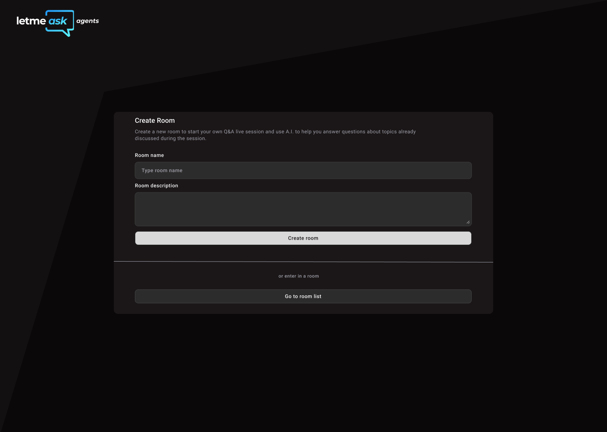

# Let me Ask: Agents 🤖

An AI-powered question and answer platform built with React and TypeScript. Users can create rooms, ask questions, and receive AI-generated responses in an intuitive interface.



## 🚀 Features

- **Room Creation**: Create dedicated spaces for Q&A sessions
- **AI-Powered Responses**: Get intelligent answers powered by AI agents
- **Real-time Updates**: Dynamic question and answer display
- **Modern UI**: Clean, responsive interface with TailwindCSS


## 🛠️ Tech Stack

### Frontend Framework
- **React 19.1.0** - Modern React with latest features
- **TypeScript 5.8.3** - Type-safe JavaScript
- **Vite 7.0.3** - Lightning-fast build tool

### Styling & UI
- **TailwindCSS 4.1.11** - Utility-first CSS framework
- **Radix UI** - Unstyled, accessible UI components
- **Lucide React** - Beautiful icon library
- **Class Variance Authority** - Type-safe variant styling

### State Management & Data Fetching
- **TanStack React Query 5.81.5** - Server state management
- **React Hook Form 7.60.0** - Form state management
- **Zod 4.0.5** - Schema validation

### Routing & Navigation
- **React Router DOM 7.6.3** - Client-side routing

### Date & Time
- **Day.js 1.11.13** - Lightweight date library

### Development Tools
- **Biome 2.0.6** - Fast linter and formatter
- **Ultracite** - Opinionated configuration preset

## 📁 Project Structure

```
src/
├── components/           # Reusable UI components
│   ├── ui/              # Base UI components (shadcn/ui style)
│   ├── create-room-form.tsx
│   ├── question-form.tsx
│   ├── question-item.tsx
│   └── room-list.tsx
├── pages/               # Page components
│   ├── create-room.tsx
│   └── room.tsx
├── http/                # API utilities and hooks
│   ├── types/          # TypeScript type definitions
│   ├── use-create-room.ts
│   └── use-rooms.ts
├── lib/                 # Utility functions
│   ├── dayjs.ts
│   └── utils.ts
├── app.tsx             # Main app component
└── main.tsx            # Application entry point
```

## 🏗️ Architecture Patterns

### Component Design
- **Atomic Design** - Hierarchical component structure
- **Compound Components** - Flexible, reusable UI patterns
- **Props Interface** - Strong TypeScript typing for all components

### State Management
- **Server State** - TanStack Query for API data
- **Form State** - React Hook Form for form management
- **Local State** - React hooks for component state

### Data Flow
- **Custom Hooks** - Encapsulated API logic
- **Type Safety** - Zod schemas for runtime validation
- **Error Handling** - Proper error boundaries and states

## 🚀 Getting Started

### Prerequisites
- Node.js 18+ 
- npm, yarn, or pnpm

### Installation

1. **Clone the repository**
   ```bash
   git clone <repository-url>
   cd web
   ```

2. **Install dependencies**
   ```bash
   npm install
   # or
   yarn install
   # or
   pnpm install
   ```

3. **Start the development server**
   ```bash
   npm run dev
   # or
   yarn dev
   # or
   pnpm dev
   ```

4. **Open your browser**
   ```
   http://localhost:5173
   ```

## 📜 Available Scripts

- `npm run dev` - Start development server
- `npm run build` - Build for production
- `npm run preview` - Preview production build

## 🔧 Configuration

### Path Aliases
The project uses path aliases for cleaner imports:
```typescript
// Instead of: import { Button } from '../../../components/ui/button'
import { Button } from '@/components/ui/button'
```

### Code Quality
- **Biome** - Fast linting and formatting
- **TypeScript** - Strict type checking
- **Ultracite** - Opinionated configuration preset

### Styling
- **TailwindCSS** - Utility-first styling
- **CSS Variables** - Theme customization
- **Responsive Design** - Mobile-first approach


## 🤝 Contributing

1. Fork the repository
2. Create a feature branch
3. Make your changes
4. Run linting and type checking
5. Submit a pull request

## 📝 License

This project is licensed under the MIT License.

---

Built with ❤️ using React, TypeScript, and TailwindCSS
